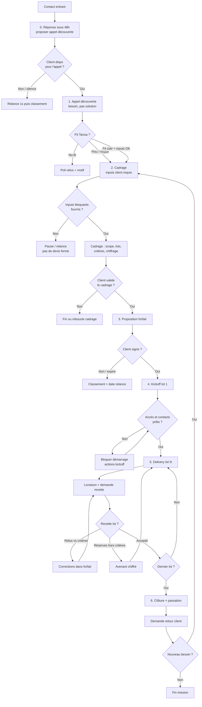

# Flow client — étapes, inputs, livrables

Processus commercial et de livraison Tanoa Systems (forfait).
À utiliser dès qu’un contact entre, y compris en phase 0.

Templates prêts à copier : [`templates/`](templates/).

## Diagramme de décision

| Étape | Objectif | Documents / inputs client | Nos livrables | Template |
|-------|----------|---------------------------|---------------|----------|
| **0. Premier contact** | Accuser réception, proposer un appel découverte | Canal de contact ; disponibilité pour un appel | Réponse sous 48 h ; proposition d’appel 30–45 min | [`00-reponse-premier-contact.md`](templates/00-reponse-premier-contact.md) |
| **1. Appel découverte** | Comprendre le **besoin** ; filtrer fit / no-fit | Contexte métier ; systèmes concernés ; contraintes (délai, hébergement, sécu) ; critère de succès ; décideur & timing | Notes internes ; go / no-go / « cadrage nécessaire » | [`01-notes-appel-decouverte.md`](templates/01-notes-appel-decouverte.md) |
| **2. Cadrage** | Périmètre et chiffrage fiables | Accès docs / APIs / schémas ; exemples de flux ou payloads ; interlocuteur technique nommé ; contraintes d’environnement | Reformulation du besoin ; périmètre in/out ; lots + critères d’acceptation ; hypothèses & risques ; chiffrage forfait | [`02-cadrage.md`](templates/02-cadrage.md) |
| **3. Proposition** | Décision client | Validation écrite du périmètre (ou commentaires) ; circuit de signature / facturation | Proposition (besoin, scope, livrables, planning, prix, hors-scope) ; conditions de facturation (ex. portage) | [`03-proposition.md`](templates/03-proposition.md) |
| **4. Kickoff** | Démarrer le lot 1 sans ambiguïté | Accès repo / VPN / environnements ; contacts ops ; validation du rythme de points | Compte-rendu de kickoff ; planning du lot 1 ; canaux & rituels (ex. point hebdo) | [`04-compte-rendu-kickoff.md`](templates/04-compte-rendu-kickoff.md) |
| **5. Delivery (par lot)** | Livrer et faire recetter | Retours sur les critères sous délai convenu ; décisions bloquantes sous X jours ; jeux d’essai / données de recette si besoin | Code / config / doc du lot ; démo ou livraison ; PV ou mail de recette du lot | [`05-livraison-lot.md`](templates/05-livraison-lot.md) · [`05-recette-lot.md`](templates/05-recette-lot.md) |
| **6. Clôture** | Clore le forfait ; capitaliser | Signature de recette finale ; éventuel retour d’expérience | Doc de passation ; inventaire livré ; demande de retour client écrit ; avenant ou suite si nouveau besoin | [`06-cloture-passation.md`](templates/06-cloture-passation.md) · [`06-demande-retour-client.md`](templates/06-demande-retour-client.md) |

## Règles

- Pas de devis **ferme** sans étape 2 (périmètre + critères d’acceptation).
- Tout hors périmètre après signature → **avenant**, pas absorption silencieuse.
- Priorité au **besoin** ; une solution technique dictée par le client se reformule en besoin avant chiffrage.
